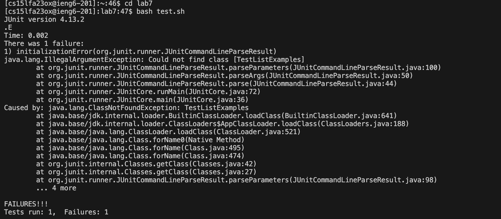

# Lab Report 4

## Step 4 

Special Keys pressed: 
```ruby
<enter> <enter>
```
I typed ssh ssh cs15lfa23ox@ieng6.ucsd.edu <enter> and then at the prompt for the password i typed my password and then <enter>. The output i obtained is in the screenshot above.

Note: i required a password as i initially set up the key on a school computer and now it wont let me add another public key. I asked a TA if it mattered if i had a password for this step and they said it was ok.

## Step 5


Keys pressed:
```ruby
<enter>
```
I typed git clone git@github.com:rsvasudev/lab7.git, which is the respective ssh link of the repository that i forked, and then pressed <enter>. This was the output I obtained.

## Step 6

```ruby
<enter> <enter>
```
I typed cd lab7 <enter>. Then I typed bash test.sh <enter>. This then provided the failure output shown in the screenshot.

## Step 7
vim ListExamples.java <enter> i insert mode. down 14 times. right 22 times. delete 3 times. result.add(0, s) to result.add(s). down 28 times.left 6 times. delete once to delete 1 in index1 then 2 to change it to index2. <esc> :wq <enter>

# Step 8
git add
- git commit -m "fix bugs"

