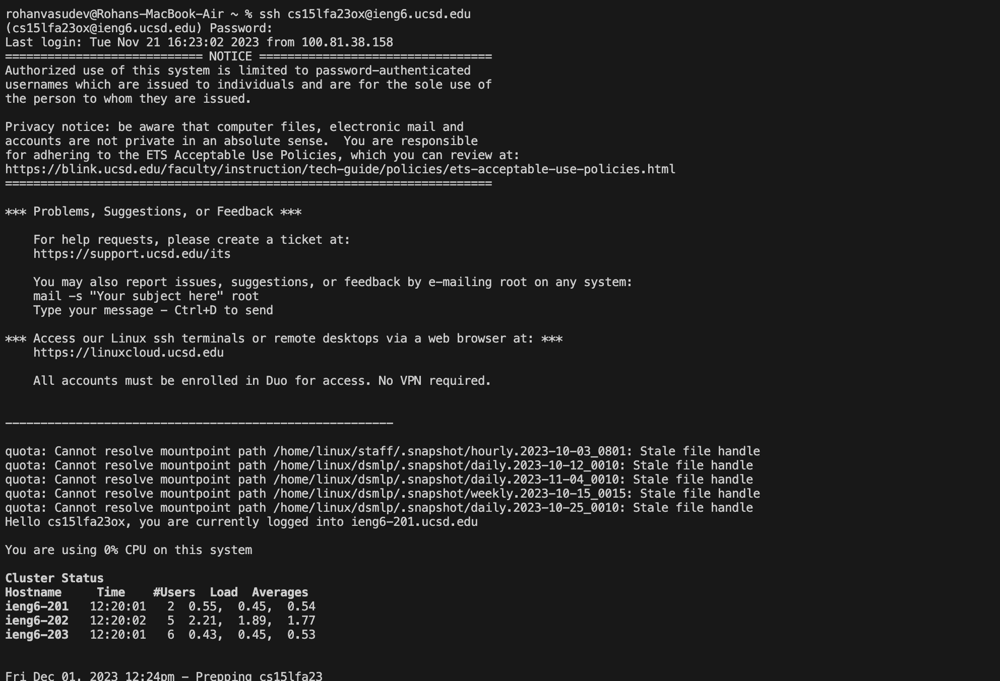
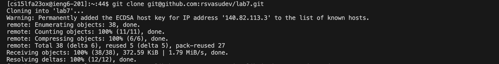
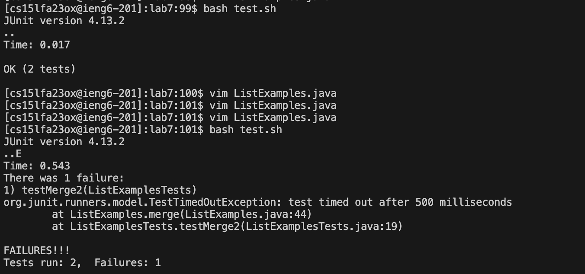
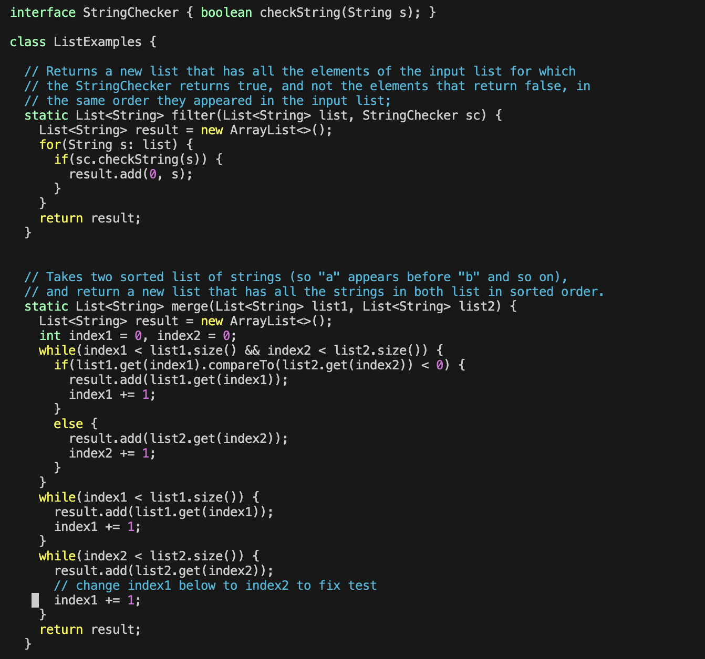
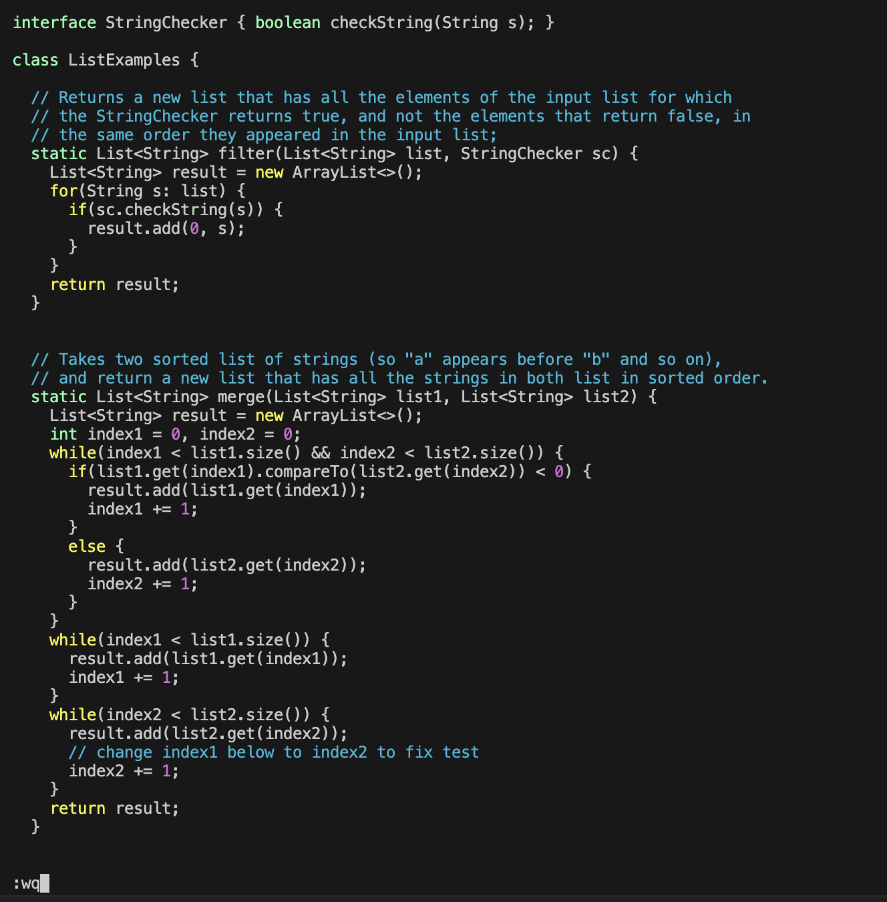
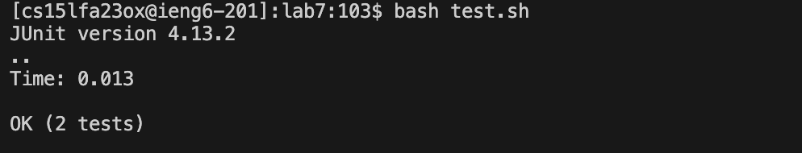
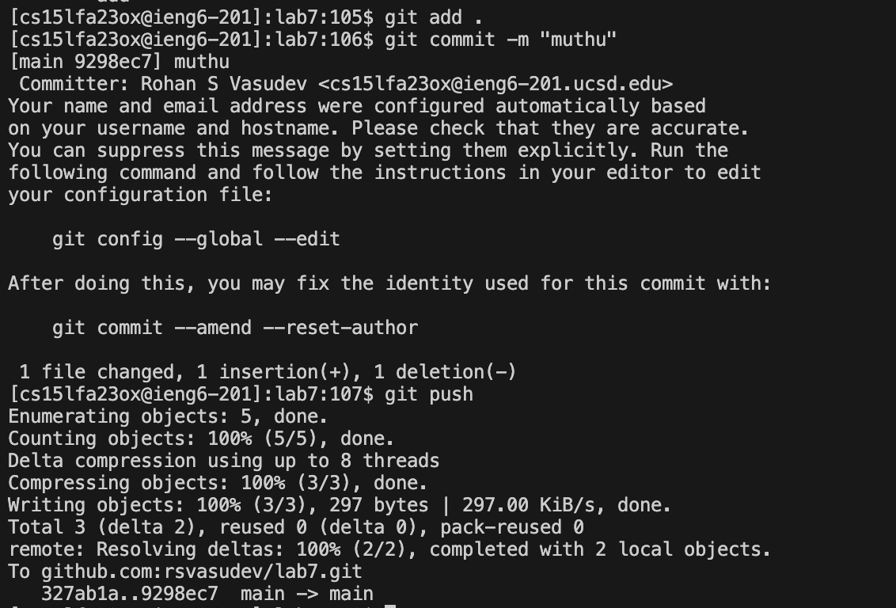

# Lab Report 4 

Note: asked  TA about spaces was told don't need to include them as special characters. I also assumed I didn't need to include <shift> as a button as I asked in office hours although i used shift sometimes where i thought it was necessary.

## Step 4 

Keys pressed: 
```ruby
ssh cs15lfa23ox@ieng6.ucsd.edu<enter>, Mypassword1<enter>
```
I typed ```ssh cs15lfa23ox@ieng6.ucsd.edu<enter>``` and then at the prompt for the password i typed my password and then ```<enter>```. The output i obtained is in the screenshot above. 
Note: I was doing this lab report on a school computer as my laptop broke, where the without password login was setup. I asked a TA if it mattered if i had a password for this step and they said it was ok.

## Step 5


Keys pressed:
```ruby
git clone <command+v><enter>
```
I typed ```git clone <command+v><enter>```, where ```<command>v``` pastes the ssh link ```git@github.com:rsvasudev/lab7.git```, and then pressed ```<enter>``` to git clone the ssh link. This was the output I obtained. Note <command+v> means both keys were pressed at the same time.

## Step 6


Keys pressed:
```ruby
cd lab7<enter>, bash test.sh<enter>
```
I typed ```cd lab7<enter>```. Then I typed ```bash test.sh<enter>``` to run the tests. This then provided the failure output shown in the screenshot.

## Step 7

Above we type the vim function to go into the code we will edit to fix the bug.

Above is the code before it was edited

This is the code after the 1 was changed to a 2 and the :wq was typed to save the changes.

Keys pressed:
```ruby
vim ListExamples.java<enter>, <shift+;>44<enter>, i<right><right><right><right><right><right><delete>2, <esc><shift+;>wq<enter>
```
I typed ```vim ListExamples.java<enter>``` to go into the code to fix the bug. Next, I typed  ```<shift>;44<enter>``` to go to the line where the bug was. Then, I typed ```i``` to go into insert mode to make edits and then ```<right><right><right><right><right><right>``` to go to where I needed to change the code. Then i typed ```<delete>2``` to chnage the index1 to index2 to fix the bug. Then, I typed ```<esc><shift>;wq<enter>``` to go out of insert mode and save my changes.

Note: ```<shift>;``` means ```:```

## Step 8

Keys pressed:
```ruby
<up><up><up><up><up><enter>
```
I pressed ```<up>``` 5 times as the ```bash test.sh``` was 5 up. The output of the successful test is shown.

## Step 9

Keys pressed:
```ruby
git add .<enter>, git commit -m "muthu"<enter>, git push<enter>
```
I typed ```git add .<enter>``` to add the change to the staging area. The I typed ```git commit -m "muthu"<enter>``` so the changes are recorded. Lastly, I typed ```git push<enter>``` to make sure the chnages were published. All these commands as they hadn't been used previously. The output is shown above. This, then, pushed it to my github account successfully.
 

